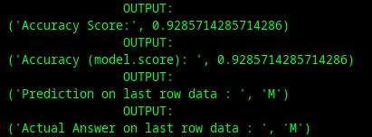

# Sonar Rock vs Mine Prediction using Machine Learning

<p align="center">
  
</p>

This project uses a **Logistic Regression** model to differentiate between underwater sonar signals reflected from a rock versus a mine. The trained model successfully achieves an **accuracy of over 90%** in this binary classification task, making it a highly effective solution.

---

## 📖 About the Project

The core of this project is a machine learning pipeline that processes sonar return data and trains a model to identify potential underwater threats. By leveraging Logistic Regression, the model learns the distinct patterns in sonar signals that separate metallic, mine-like objects from natural rock formations, providing a reliable predictive tool for underwater navigation and security.

---

## 🎯 Key Features

-   **High-Accuracy Model:** Achieves over **90% accuracy** on the test dataset.
-   **Efficient Classification:** Utilizes a lightweight and effective **Logistic Regression** algorithm.
-   **Streamlined Workflow:** A clear, two-step Python script process for data preparation and model training.
-   **Reliable Predictions:** Builds a predictive system capable of classifying new sonar data as either a "Rock" or a "Mine".

---

## 💻 Technologies Used

-   **Python:** The core programming language for the project.
-   **Pandas:** For data manipulation and analysis.
-   **NumPy:** For efficient numerical operations.
-   **Scikit-learn:** For building and evaluating the machine learning model.

---

## 🚀 Getting Started

To get a local copy up and running, follow these simple steps.

### Prerequisites

You must have Python 3.x and pip installed on your machine.

### Installation

1.  Clone the repository:
    ```sh
    git clone [https://github.com/aidevsurya/Sonar-RockVsMine-ML.git](https://github.com/aidevsurya/Sonar-RockVsMine-ML.git)
    ```
2.  Navigate into the project directory:
    ```sh
    cd Sonar-RockVsMine-ML
    ```
3.  Install the required libraries:
    ```sh
    pip install numpy pandas scikit-learn kagglehub
    ```

---

## ⚙️ How to Run

The project is designed to be run in two simple steps from your terminal.

1.  **Prepare the Dataset**
    First, run the `dataset.py` script. This will process the raw data and prepare it for training.
    ```sh
    python dataset.py
    ```

2.  **Train the Model**
    Next, run the `train_model.py` script. This will train the Logistic Regression model on the prepared data, evaluate its performance, and display the accuracy.
    ```sh
    python train_model.py
    ```

---

## 🤝 Contributing

Contributions are what make the open-source community such an amazing place to learn, inspire, and create. Any contributions you make are **greatly appreciated**.

1.  Fork the Project
2.  Create your Feature Branch (`git checkout -b feature/AmazingFeature`)
3.  Commit your Changes (`git commit -m 'Add some AmazingFeature'`)
4.  Push to the Branch (`git push origin feature/AmazingFeature`)
5.  Open a Pull Request

---

## 📜 License

Distributed under the MIT License. See `LICENSE` for more information.

---

## 🙏 Acknowledgements

-   The dataset was sourced from **KaggleHub**.
-   The open-source community for providing amazing tools and libraries.
